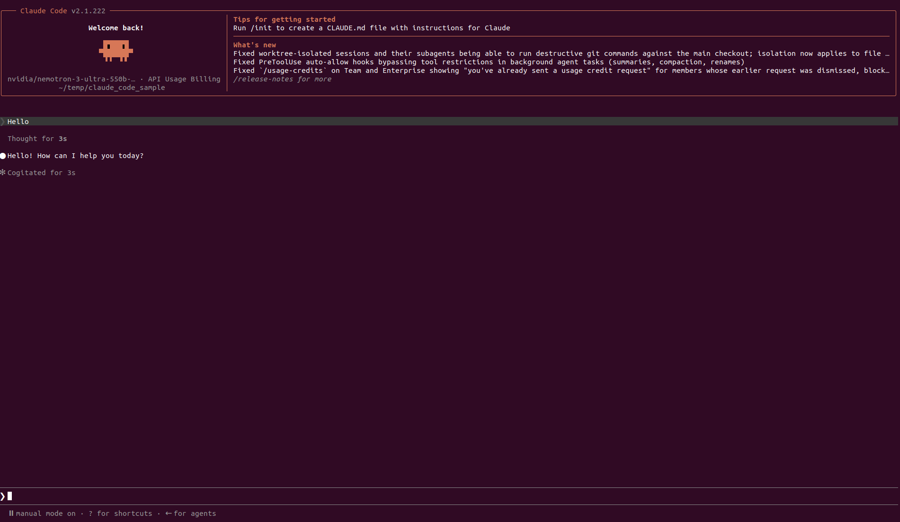
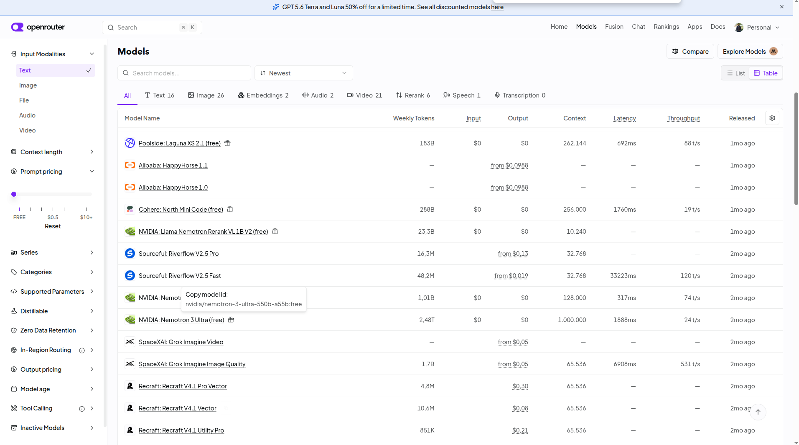

# Description
Poc Use Claude Code with Openrouter. You can use free models to be used with Claude Code

# Dependencies
You must have claude code just installed in you host
Linux:
```shell
$ curl -fsSL https://claude.ai/install.sh | bash
```

Windows:
```shell
c:/ irm https://claude.ai/install.ps1 | iex
```

# Steps

- **STEP01**: create project folder
```shell
$ mkdir claude-code-sample
$ cd mkdir claude-code-sample
``` 

- **STEP02**: create claude code configuration file
Create the claude local folder and the `settings.json` congiguration file:

```shell
$ mkdir .claude
$ nano .claude/settings.json
``` 

Write this configuration. Inside you must fill your Openrouter API_KEY and model selected from there:
```shell
{
  "env": {
    "OPENROUTER_API_KEY": "<YOUR_OPENROUTER_API_KEY>",
    "ANTHROPIC_BASE_URL": "https://openrouter.ai/api",
    "ANTHROPIC_AUTH_TOKEN": "<YOUR_OPENROUTER_API_KEY>",
    "ANTHROPIC_API_KEY": "",
    "ANTHROPIC_MODEL": "nvidia/nemotron-3-ultra-550b-a55b:free"
  }
}
```

- **STEP03**: open claude code
Inside your previous code base directory `claude-code-sample`, execute claude code as usual
```shell
$ claude
```



To select free models from openrouter go to its page [Openrouter Models Portal](https://openrouter.ai/models) find a free one a get the model id to be used in claude code settings.json



